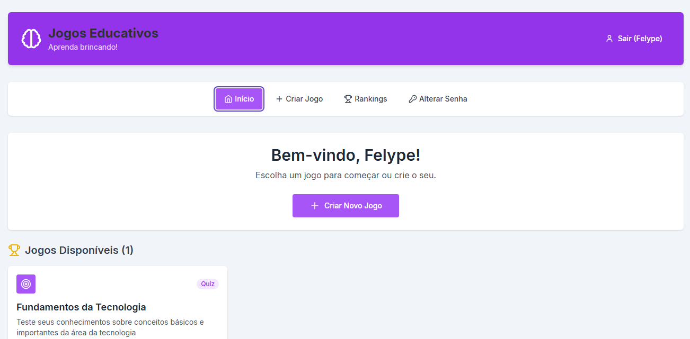

# 🎮 Plataforma de Jogos Educativos

Um sistema web completo para a criação, compartilhamento e jogabilidade de jogos educativos, com sistema de usuários e ranking de pontuações.

## 🌐 Tela Inicial do Projeto

Abaixo, uma visão geral da página principal da aplicação após o login do usuário:



## 📝 Descrição do Projeto

Esta aplicação foi desenvolvida como projeto para a disciplina de Programação Web, visando criar uma plataforma interativa e funcional. O sistema permite que usuários se cadastrem, criem seus próprios jogos baseados em "Termos e Definições" e "Itens e Categorias", e joguem os games disponíveis.

O projeto foi construído com uma arquitetura moderna, separando o **backend** do **frontend**, e utiliza um banco de dados **MongoDB** para persistir todos os dados de usuários, jogos e resultados.

---

## ✨ Funcionalidades

* **Gerenciamento de Usuários:**
  * Cadastro de novos usuários com senha criptografada.
  * Login com autenticação segura via **JSON Web Tokens (JWT)**.
  * Alteração de senha para usuários já logados.

* **Criação de Conteúdo:**
  * Interface para cadastrar um conjunto de **Termos e Definições**.
  * Interface para cadastrar **Itens e Categorias**.

* **Geração e Jogo:**
  * Criação de 4 tipos de jogos a partir dos dados inseridos:
    1.  **Jogo da Memória**
    2.  **Quiz de Múltipla Escolha**
    3.  **Jogo de Associação** (digitação)
    4.  **Jogo de Arrastar e Soltar** (agrupar itens em categorias)

* **Ranking e Resultados:**
  * Todos os resultados das partidas são salvos no banco de dados.
  * Tela de Ranking que exibe as melhores pontuações, com filtros.

---

## 🛠️ Tecnologias Utilizadas

### Backend

* **Node.js** – Ambiente de execução do servidor.
* **Express.js** – Framework para a construção da API.
* **MongoDB** – Banco de dados NoSQL.
* **bcrypt** – Criptografia de senhas.
* **jsonwebtoken (JWT)** – Autenticação baseada em tokens.

### Frontend

* **React** – Biblioteca para a construção da interface.
* **Vite** – Ferramenta de build e servidor de desenvolvimento.
* **Tailwind CSS** – Framework CSS para estilização.
* **shadcn/ui** – Componentes de UI.

---

## 🚀 Como Instalar e Executar

Siga os passos abaixo para executar o projeto em sua máquina.

### Pré-requisitos

* [Node.js](https://nodejs.org/) (versão 14 ou superior)
* [npm](https://www.npmjs.com/)

### 1. Clonar o Repositório

```bash
git clone [https://github.com/Felype-cybher/GameWeb.git](https://github.com/Felype-cybher/GameWeb.git)
cd GameWeb
```

### 2. Rodar o Backend

1.  **Navegue até a pasta do backend:**
    ```bash
    cd backend
    ```

2.  **Instale as dependências:**
    ```bash
    npm install
    ```

3.  **Execute o servidor:**
    ```bash
    npm run dev
    ```
    O backend estará rodando em `http://localhost:3001`.

### 3. Rodar o Frontend

1.  **Abra um novo terminal.**
2.  **Navegue até a pasta do frontend** (a partir da raiz do projeto):
    ```bash
    cd frontend
    ```

3.  **Instale as dependências:**
    ```bash
    npm install
    ```

4.  **Execute a aplicação:**
    ```bash
    npm run dev
    ```
    O site estará acessível no endereço indicado no terminal (geralmente `http://localhost:5173`).
